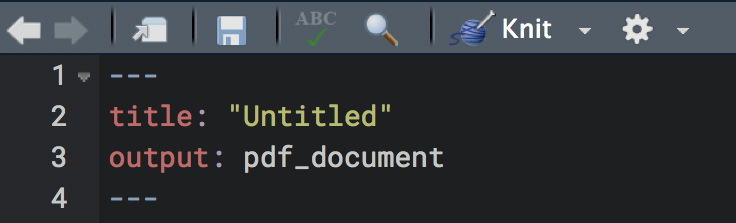

# Comparison to Alternatives

## PDF & LaTeX

### $\LaTeX$

If you're reading a printed or PDF document and it appears to be massaging your eyeballs in both its look and feel, it likely was constructed with $\LaTeX$[^layteks]. $\LaTeX$, along with its derivatives, is a type-setting system specifically designed for scientific or other technical documents by Donald Knuth *back in the 1970s*.  If you aren't familiar with it, you should know that whole academic disciplines have essentially required it for communication in their field for many years.  What's more, R has been $\LaTeX$-able since the beginning, via S expressions and code chunks (Sweave)<span class="marginnote">S -> R, Sweave -> knitr.  Now you know.</span>, allowing one to weave the code and results together in one document.  The following shows an example of $\LaTeX$ syntax.

```
\documentclass{article}
\title{Use R Markdown in lieu of $\LaTeX$}
\author{Me, Myself, and I}
\date{November 5th}
\begin{document}
 
  \maketitle
  Hello world!
   
  $$ E = mc^2 $$
   
  <<r chunk>>=
  x = runif(10)
  @
  
\end{document}
```

$\LaTeX$ requires a $\TeX$ installation. But once you have that you can write a document using the syntax (`File/New File/R Sweave...`), with the end result typically being a PDF document (or e.g. Beamer slides). When the document is complete, it will look utterly beautiful, precisely because you had fine control over the look and feel of everything.  Just like you can tell a PDF created originally in MS Word by its looks in a bad way, you can often tell if someone used $\LaTeX$ because of how nice the document looks.  As for some examples, every R vignette that is PDF was created using $\LaTeX$ or, more recently R Markdown.  Here is one [example](https://cran.r-project.org/web/packages/brms/vignettes/brms_overview.pdf).  In addition, practically the vast majority of scientific texts are written with it.

Unfortunately, $\LaTeX$ is also a complete pain in the ass.  Your writing is constantly interrupted by the syntax even for the most minor things, you will pull your hair out trying to get images and tables the way you want, and so forth.  Your document will look fantastic, but you will not feel better about yourself afterward.


### PDF via R Markdown

The great thing about using a standard R Markdown, instead of the fully $\LaTeX$ approach with the `.Rnw` file, is that you can use $\LaTeX$ syntax as much or little as you like, still get the same results, and, using the same $\TeX$ installation, produce a great looking PDF document.  To do this, create a an R Markdown document as you normally would, but select PDF instead of HTML.




The following shows how to do the formula in the $\LaTeX$ syntax above in R Markdown, and what it produces.

```
$$ E = mc^2 $$
```

$$ E = mc^2 $$

The syntax and result are exactly the same. Thus, for those who use $\LaTeX$, their life just got extremely easier, because they can essentially create a $\LaTeX$ document without any explicit $\LaTeX$.  But if they do want to use it for some things, they can do so just as they did before.  


Once you've installed $\TeX$, you'll not need to use it directly, but will now be able to knit documents to PDF<span class="marginnote">I suggest [tinytex](https://yihui.name/tinytex/) for your TeX installation.</span>. With the $\TeX$ installation, you'll also be able to intermingle standard text, $\LaTeX$, and R code seamlessly in your R Markdown document.

```
Here is some text!

\medskip

``{r}
x = rnorm(10)
``

$$\mathrm{SomeFormula} = Q_{123}^2$$

\bigskip

\begin{quote}
We should forget about small efficiencies, say about 97% of the time: premature optimization is the root of all evil. Yet we should not pass up our opportunities in that critical 3%.   ~~ Donald Knuth
\end{quote}

\pagebreak
```

As noted, the YAML for your document will look similar to an HMTL document.

```yaml
---
title: "Habits"
output:
  pdf_document:
    toc: true
    number_sections: true
---
```

$\LaTeX$-specific options are also available for those familiar with it.


```yaml
---
title: ""
output:
  pdf_document:
    toc: true
    number_sections: true
    citation_package: natbib
    latex_engine: xelatex
    keep_tex: true
    includes:
      in_header: header.tex
      before_body: doc_prefix.tex
      after_body: doc_suffix.tex
    template: quarterly_report.tex
---
```


### Tufte

One nice thing in the PDF department is the option of using Tufte styling.  Edward Tufte did much to bring statistical graphics and presentation into forms far more suitable for communication and just simply more beautiful.<span class="marginnote">I would still recommend Tufte's *The Visual Display of Quantitative Information*, as the ideas are still useful for printed work, and would possibly provide some decent ideas for visual display in any format.</span>

In the past, I used the Tufte handout and book classes for my PDF documents, because I liked the <span class="emph">sidenote</span> and <span class="emph">marginnote</span> capabilities. R Markdown offers Tufte styling for PDF, which is great, and makes it easy for anyone to make their $\LaTeX$ approach to PDF even better.  They are also offered for HTML, but very little developed at this point[^tuftehtml].  I still like the marginnote approach, to the point I made my own CSS class to use them.  Sidenotes, which were used to create footnotes at the point they are created rather than at the bottom of a page, are unnecessary with HTML, because a link is created that makes it easy to go back and forth from the footnote.


### A final word

There are some who still seem to think using raw $\LaTeX$ is in fact necessary instead of R Markdown, but they are wrong.  You can only do the same with a lot more effort.  It's really not worth the hassle.


## MS Word

Probably the most common tool I see people use for their scientific and related reporting is Microsoft Word. They fight it for all the 'features' it provides, then they fight it to get their images to look okay after pasting them from somewhere else, then they fight it early and often to get the tables just the way they like it, until just settling on something that gets the job done.  Even the slightest change to the data will result in having to redo practically everything.  Because of all the pasting and finagling with numbers after changes, it's almost guaranteed that errors will arise, and they regularly do.  And finally, MS Word documents look like MS Word documents, even if you convert it to something else.  In other words, unimpressive.  People using Word directly are not engaged in reproducible research, and if they are coupling it with menu driven statistical analyses, their work is problematic from any scientific viewpoint[^econfail]. 

If you feel you must have a MS Word document, and you're wrong about this, because excellent academic research is regularly done without it and always has been, know that you can still create a Word document as a final product with R Markdown[^msword].  Just select the Word option when creating your R Markdown document, or switch to it when you want via the Knit drop-down menu.  As might be obvious, you'll need MS Word installed if you're going to create such documents.  While this will at least bring reproducibility to your MS Word experience, I wouldn't recommend using it for anything, and so I will spend very little effort explaining to you how to do it[^nowordXP].  

The main thing you need to know is how to use a template.  MS Word defaults have been terrible since its inception, so after customizing a document to look the way you want, you can then use it as a template.  Just specify the document you've created in the YAML as follows:


```yaml
output:
  word_document:
    reference_docx: my_template.docx
```

Even then it likely won't be a 100% match, because again, we're talking about a product that doesn't work that well with many of its own commonly used features. Besides that though, some of the other typical things R Markdown aspects will apply, such as syntax highlighting and figure sizes.  However, don't be surprised that you lose a lot of functionality.  MS Word is a <span class="emph hoverfoot" title='what you see is what you get'>wysiwyg</span> text editor, and what you're doing is definitely not merely text editing. While R Markdown can at least introduce some reproducibility to your word document, just know that it won't even be the second-best option you could have chosen for scholarly or professional publication.

### Word-like Alternatives

There are a couple more alternatives in the MS Word area.  You can also output Rich Text Format or OpenDocument Text (ODT) format.  Specify the following in your YAML.

```yaml
output: rtf_document
```

```yaml
output: odt_document
```

Don't expect too much here. They are relatively little used, and probably don't have near the functionality.  Again though, the basic stuff should still work.


[^msword]: People sometimes tell me they have to use it because of a collaborator.  I would suggest that they explain that it isn't in the best interest of the research or its products to do so.  If the person insists, their role in the research, and certainly the document, should be diminished.

[^econfail]: You shouldn't be using MS Excel for statistical analysis, so why would you use MS Word to report it? 

[^tuftehtml]: They really are useless at the time of this document's creation (2018-03-01), neither adhering to basic Tufte or web principles. Avoid it until updated.

[^nowordXP]: I will also admit that I simply don't use it myself, and so don't have much to report.