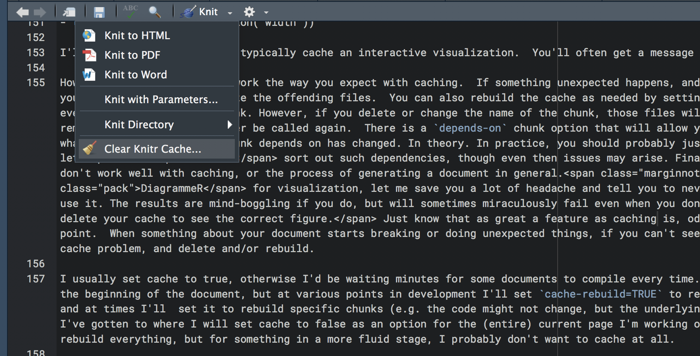

# Common Considerations

In creating a document there several things that consistently come up that you'll want to be aware of, and we'll visit some of those here.

## Using HTML

The first thing to do is simply get used to HTML as your primary output.  Unless you know the document is to be printed in a traditional format, you won't gain anything by using the non-HTML outputs but an uglier and/or less flexible document without having to put notably more effort into development. This is especially the case when the code is the focus, and you're using R Markdown as you would a normal R script, albeit in more organized fashion.  

## Chunk options

A ridiculous number of [options](https://yihui.name/knitr/options/) are available to you for each chunk.  Spend a little time to see what all is available.  The options I commonly use are: 

- `echo`: Controls whether and how you want to *show* your code. It can be logical (TRUE/FALSE), or a numeric specifying specific line numbers.
- `eval`: Controls whether and how you want to *run* your code. It can be logical (TRUE/FALSE), or a numeric specifying specific line numbers.
- figure controls: `fig.*` `out.* `etc.

### Setup to apply to all

Then there are other options that I set at the beginning of a document. The reason for doing so is because I will rarely, if ever, want these options changed.  As such, I create a chunk to specify these options at the beginning, and only change them as need be for specific chunks.  *Any* option you would specify for a specific chunk can be defined here and applied to all by default.

```{r knit_opts, eval=FALSE}
knitr::opts_chunk$set(echo = T, message=F, warning=F, error=F, 
                      comment=NA, cache=T, R.options=list(width=220), 
                      fig.align='center', out.width='75%', fig.asp=.75)
```

These options do things like make sure messages, warnings, and errors don't show up in the document.<span class="marginnote">You can still get errors, and they will keep your document from compiling.</span> Note that any specific chunk options will override these.  So, you'll always have fine control over how things work.

You can also specify options for the way <span class="pack">knitr</span> itself works.  For example, `*.Rmd` documents by default ignore the fact that you are using an RStudio project, and instead work from wherever the `*.Rmd` file is. Using `root.dir` can correct this.  There is also a global option you can set via the tools menu[^rmdrstudio].

```{r knit_opts2, eval=FALSE}
knitr::opts_knit$set(root.dir = '../', child = 'someotherdoc.Rmd')
```


## Image options

There are primarily three ways you'll display images. Some will be the result of R code, possibly even interactive. In other instances, you'll already have access to an image file and want to display it via markdown or HTML. Technically you could do this with R code as well, but it'd be more trouble than necessary, as markdown and HTML already provide the means.

### R graphics

Where to begin?  There are many, many ways to manipulate an image that is produced by your R code, and this is not necessarily a good thing.  Thankfully, the default settings may be enough, but in my experience it rarely is.

#### HTML vs. Others

To begin, there are different systems for PDF or MS Word vs. HTML-based documents. For non-HTML, the chunk options of `fig.width` and `fig.height` are generally used for figure dimensions. Oddly, these are expressed in inches, but at least it is easy enough to manipulate to your liking.  While you can use them in HTML for static images as those produced by ggplot2, there isn't a reason I can think of to express the size in inches for an electronic display.  Furthermore, these settings will not affect interactive and possibly other images in HTML documents except in unexpected ways[^widthplotly].  

You can also supply `fig.width` plus `fig.asp` which will produce a height that is `fig.width*fig.asp`.  There is also `fig.dim`, which will take the two values you would have specified for `fig.width` and `fig.height`.  If you supply `fig.dim` with `fig.asp`, the latter will be ignored.  If expressing size in inches doesn't make sense to you, you can use `dpi`, which will allow you to know think of `dpi*inches` as what to expect in terms of pixels.  You also have `fig.align` with options like 'left' and 'center', but it apparently has no effect on <span class="pack">htmlwidgets</span> and similar packages that rely on other languages like JavaScript.

Isn't this fun?  Here is some more.

The `out.width` and `out.height` options are geared toward HTML-based visualization, and are expressed in pixels, or perhaps most usefully, percentages.  There is also `out.extra` that will apply additional arguments (e.g. css/img styling).  These `out.*` can also apply to PDF/$\LaTeX$ figures (but I can't figure out why).   I also find that `out.height` actually does nothing in many cases. What's more, you can use them alongside `fig.width` and `fig.height` to ensure you'll have utterly no idea what will be produced in the finished product.  The option `fig.retina` will only work for HTML documents, and will scale your image such that it will "change the chunk option dpi to dpi * fig.retina, and out.width to fig.width * dpi / fig.retina internally; for example, the physical size of an image is doubled and its display size is halved when fig.retina = 2". It might not have any discernible effect that you can actually see in the document depending on your default settings, but would allow viewers to zoom without loss of clarity, though they could do that with an **svg** image anyway.  You may specify the image output type, \*.png or \*.svg for example, with `fig.dev`.


In the following, all of these arguments might have an effect on the resulting image.

```{r figcrazy, echo=FALSE, results='markup'}
cat("```{r, fig.width=3, fig.height=4, out.width='30%', fig.retina=2}
library(plotly)
data %>% 
  plot_ly(width=500) %>% # in pixels!
  add_markers(~x, ~y)
```")
```


<!-- ````markdown -->
<!-- `r ''````{r, fig.width=3, fig.height=4, out.width='30%', fig.retina=2} -->
<!-- library(plotly) -->
<!-- data %>% -->
<!--   plot_ly(width=500) %>% # in pixels! -->
<!--   add_markers(~x, ~y) -->
<!-- ``` -->
<!-- ```` -->

<!-- This is neat, now all my text is blue because of that ridiculous hack to show an r chunk-->


In short, for my typical usage, having all these options is nice, but mostly just confusing, because all I ever really need to specify is width, height and alignment.  See the [summary][Image Summary] for a simplified approach.  In addition, there are many other options, e.g. captions, that may come in handy. 


<!-- ```{r} -->
<!-- # fig.width default -->
<!-- library(plotly) -->
<!-- mtcars %>%  -->
<!--   plot_ly(x=~wt, y=~mpg) -->
<!-- ``` -->
<!-- ```{r fig.width=2} -->
<!-- # fig.width = 2 -->
<!-- mtcars %>%  -->
<!--   plot_ly(x=~wt, y=~mpg) -->
<!-- ``` -->

<!-- ```{r fig.height=2} -->
<!-- # fig.height = 2; same as default -->
<!-- mtcars %>%  -->
<!--   plot_ly(x=~wt, y=~mpg) -->
<!-- ``` -->

<!-- ```{r fig.width=10} -->
<!-- # fig.width = 10 -->
<!-- mtcars %>%  -->
<!--   plot_ly(x=~wt, y=~mpg) -->
<!-- ``` -->


#### Package options

As depicted in the <span class="pack">plotly</span> example above, you often can modify the display settings of the plot with options of the visualization package you're using.  This will possibly override, or merely interact with, the chunk options, so use with caution.


### Markdown

Markdown provides a basic way to insert images into the document as follows.

```
{width=50%}
```

It's identical to a link, just with an exclamation point. 

### img

The typical way to insert an image is with HTML.  This allows you to specify all the options you need to align and style it.

```

```

Compared to the markdown approach, this should probably be your default approach to inserting images in your document that aren't produced by R code. 

### Image summary

If you are going to do PDF or MS Word, or doing static plots in HTML, `fig.width`, `fig.height`, and `fig.align` will likely take care of most of your needs. For HTML, I use `out.width` with a given percentage, plus `fig.asp`, and that has solved a lot of my remaining issues.  For image files, I use \ because the markdown approach is really too bare bones. I suggest you set your figure options at the beginning of the document so that your images will be consistent, and modify if necessary for a specific chunk.  I don't see much need for anything beyond svg and png, the latter if file size is a concern only.  You'll want scalable images, as provided by svg<span class="marginnote">The <span class="pack">svglite</span> package will create smaller svg files, and can be specified with `fig.dev` just like svg or png.</span>, because you don't know what device people are using or if they want to zoom. 


## Caching


<span class="emph">Caching</span> is both a great thing and continuous source of frustration.  First, what is it?  Caching saves the output of your R chunks into compressed files (*.RData) into a folder in the directory of your current project (or some sub-directory of your choosing).  The next time you compile the document, you don't actually have to run any code, if the code hasn't changed; it will just call the cached object.  When your document has a lot of computations, or in the spirit of reproducibility, actually runs your models, this will save a lot of time.


However, this is not a straightforward process.  When things change, the cache for the chunk must change. But what about subsequent chunks that depend on those results? The following is from the <span class="pack">knitr</span> package author Yihui Xie:

>Let me repeat the three factors that can affect cache (any change on them will invalidate old cache):

>- all chunk options except include; e.g. change tidy=TRUE to FALSE will break the old cache, but changing include will not affect R code in a chunk; 
- a tiny change in the R code will lead to removal of old cache, even if it is a change of a space or a blank line
- the R option width (getOption('width'))

I'll add that you also don't typically cache an interactive visualization.  You'll often get a message to that effect if you try.

However, things often don't work the way you expect with caching.  If something unexpected happens, and if you're naming the chunks, you can easily find and delete the offending files.  You can also rebuild the cache as needed by setting `cache-rebuild` to true, even just for a specific chunk. However, if you delete or change the name of the chunk, those files will have to be explicitly removed, because they'll never be called again.  There is a `depends-on` chunk option that will allow you to update a cache if whatever previous chunk a chunk depends on has changed. In theory. In practice, you should probably just put `auto.dep` to true and let <span class="pack">knitr</span> sort out such dependencies, though even then issues may arise. Finally, some packages simply don't work well with caching, or the process of generating a document in general.<span class="marginnote">If you ever use <span class="pack">DiagrammeR</span> for visualization, let me save you a lot of headache and tell you to never cache the chunks where you use it. The results are mind-boggling if you do, but will sometimes miraculously fail even when you don't. Be prepared to constantly delete your cache to see the correct figure.</span> Just know that as great a feature as caching is, odd things will happen at some point.  When something about your document starts breaking or doing unexpected things, if you can't see a code problem, assume it's a cache problem, and delete and/or rebuild.

<br>

<br>

I usually set cache to true, otherwise I'd be waiting minutes for some documents to compile every time.  I set that as an option at the beginning of the document, but at various points in development I'll set `cache-rebuild=TRUE` to refresh everything[^cleandoc], and at times I'll  set it to rebuild specific chunks (e.g. the code might not change, but the underlying object has)[^checksum].  I've gotten to where I will set cache to false as an option for the (entire) current page I'm working on, so that I don't have to rebuild everything, but for something in a more fluid stage, I probably don't want to cache at all.


## Cleaning up output

Several packages are available to make your R results look better.  Here's a default <span class="objclass">data.frame</span>, ugly. 

```{r dataframe}
head(mtcars)
```

One can start with <span class="pack">knitr's</span> <span class="func">kable</span> to create simple tables that look much better.
<span class="marginnote">Your tables will look a little different due to my CSS settings.</span>

```{r kable}
kable(head(mtcars))
```

<br>

That was easy! Now use <span class="pack">kableExtra</span> to do some more fun stuff.

```{r kableExtra}
mtcars %>%
  slice(1:10) %>% 
  arrange(mpg) %>% 
  round(2) %>% 
  mutate(mpg = factor(mpg)) %>% 
  mutate_if(is.numeric, function(x) {
    cell_spec(x, bold = T, 
              color = spec_color(x, end = 0.9, option = 'plasma', direction = -1),
              font_size = spec_font_size(x))
  }) %>%
  mutate(mpg = cell_spec(
    mpg, color = 'white', bold = T,
    background = spec_color(1:10, end = 0.9, option = 'viridis', direction = -1)
  )) %>%
  kable(format='html', escape = F, align = 'c') %>%
  kable_styling(c('condensed', 'basic'), full_width = F, position='left')
```

<br>

For interactivity and more options to play with, consider the <span class="pack">DT</span> package.

```{r dt}
DT::datatable(mtcars, 
              class = 'nowrap',
              options = list(autoWidth = TRUE,
                             columnDefs=list(list(width='50%', targets=0))))
```

<br>


<span class="marginnote">Often after displaying tables and figures you'll want to put an extra line with \<br\> to give some more space before your next bit of text.</span>
Even model objects can go straight to publication-ready tables with no effort on your part. The <span class="pack">broom</span> package works with many common model objects to convert their output to a <span class="objclass">data.frame</span> via <span class="func">tidy</span>. Then you can use <span class="pack">kable</span> or another package to pretty it up.

```{r broom_kable, out.width='50%'}
broom::tidy(lm(mpg ~ wt, mtcars)) %>% 
  kable(format = 'markdown', digits = 2) %>% 
  kable_styling(c('basic', 'condensed'), position = 'center')
```
<br>

The <span class="pack">pander</span> package also provides more control over tables, but also can work with some model objects directly.

```{r broom_pander, out.width='50%'}
lm(mpg ~ wt, mtcars) %>% 
  summary() %>% 
  pander::pander(round=2, justify='lrrrr', caption='Regression results')
```

<br>

For converting such things to $\LaTeX$ syntax, you will want to look at <span class="pack">xtable</span>, <span class="pack">stargazer</span>, and <span class="pack">Hmisc</span> packages.<span class="marginnote">Even if you don't need interactivity, I would add <span class="pack">DT</span> to your regular toolbox for tables, especially for HTML documents.</span>

## Other Stuff

Some other things that may be very common depending on your typical output include the following.

- Footnotes
- Citations and References
- Merging multiple `*.Rmd` files into a single document

As such minutia goes beyond introductory level detail and may not be of interest to all, see the [appendix][appendix] if interested.


In summary, you can get to publication-ready results with figures, tables and text by just using the standard options or available packages, without having to go through the usual tedium of trying to format individual cells, copy-pasting, and settling for re-sized images that look like poor.  That alone should be enough to start using R Markdown for many people.  


[^widthplotly]: Changing `fig.width` for a <span class="pack">plotly</span> image seems to affect the height, while `fig.height` doesn't do anything.

[^cleandoc]: For building website like documents, e.g. using <span class="pack">bookdown</span>, there is a `Clean All` option. However, all this does is delete files that get overwritten already, and so serves almost no purpose except to get rid of old files that are no longer part of the document.

[^checksum]: A better way to probably do this is with `cache.extra = tools::md5sum('myfile.csv')`. That will, for example, rebuild the cache if that `*.csv` file has changed.

[^rmdrstudio]: This global option in RStudio seems to be ignored in some situations.
