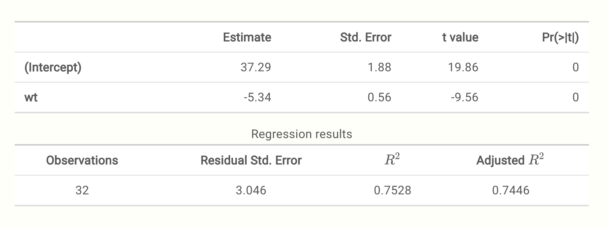

```{r setup, include=FALSE}
options(htmltools.dir.version = FALSE)

knitr::opts_chunk$set(echo = T, message=F, warning=F, error=F, comment=NA, R.options=list(width=220),   # code 
                      dev.args=list(bg = 'transparent'), dev='svglite',                                 # viz
                      fig.align='center', out.width='75%', fig.asp=.75)                                                         # cache

library(kableExtra)
```

```{r theme, include = FALSE}
library(xaringanthemer)
solarized_light(
  # base_color = "#1c5253",
  background_color = "#fffff8",
  header_font_google = google_font("Josefin Sans"),
  text_font_google   = google_font("Roboto", "300", "300i"),
  code_font_google   = google_font("Roboto Mono")
)
# https://github.com/gadenbuie/xaringanthemer

```


background-image: url("../img/RMarkdownOutputFormats.png")
class: center, top, inverse

# R Markdown

---

# Concepts


<span class="emph">Reproducible research</span>

<span class="emph">Replicable science</span>

<span class="emph">Reproducible data analysis</span>

<span class="emph">Dynamic data analysis</span>

<span class="emph">Dynamic report generation</span>

<span class="emph">Literate programming</span>

---

# Concepts

## Literate Programming

> I believe that the time is ripe for significantly better documentation of programs, and that we can best achieve this by considering programs to be works of literature. <br> ~ Donald Knuth (1984)

Interweaving code and text to tell a data story

---
 
# Concepts

## Replicability and Reproducibility
.pull-left[
- Crisis!
- Not precisely defined
- Ideals/Goals


- Reproducible data analysis requires:
    - Data
    - Code
    - Clear documentation
        - data *and* code
    - Version control
    - Standard means of distribution
    - Literate programming practices
]

.pull-right[

]

---
class: center

# Concepts

<br><br>

.larger[
Dynamic Data Analysis

<span class="emph">Science as Software Development</span>
]

---

class: inverse, center, middle

# Getting Started
---

# Getting Started

Markdown

Documents

Presentations

Shiny Apps

Templates

How to start

---

class: center

#  Markdown


```
# TITLE

## Subtitle

Some text that is *emphasized*.

 **BOLD text.**

- List item 1
- List item 2

1. item #1
2. item #2
```


---

# Documents

`File/New File/R Markdown...`


---

# Documents

Standard HTML

R Notebooks

Radix

Bookdown

---

# Presentations


Make your own presentations with just basic markdown syntax.  

- HTML/javascript: revealjs, remarkjs
- PDF/Beamer: avoid
- Power point: ??

---

# Shiny Apps


<span class="emph">Shiny</span> is an inherently interactive format 

Used for the creation of websites and applications


---

# Templates


Templates are available for any number of things, and one can find plenty among specific packages. 

- After package installation, the template becomes available

You can also create your own

---
class: center, middle


# <h1 style="color: #23373B">How to start...</h1>

Steal it, change it, post it!


---
class: inverse, center, middle

# Standard Documents

---

# Standard Documents

.pull-left[R Markdown files

- extension *.Rmd

Combination of:

- text
- chunks of R code
- possibly other code or syntax
- all within a single file

.center[HTML - PDF - MS Word]
]


.pull-right[
<br>
.smaller[
Various packages, e.g. <span class="pack">rmarkdown</span>, <span class="pack">knitr</span>, <span class="pack">pandoc</span>, etc., work behind the scenes to knit all those pieces into one coherent whole, in whatever format is desired. Pandoc is the universal translator that takes various formats, particularly markup languages, and converts them into others.  The <span class="pack">knitr</span> package is the driving force behind most of what is done to create the final product.
]
]


---

# HTML

Most flexible

Displays everything as it should

Little *good* reason to use something else

Few limitations, create anything from:
- single page
- dashboards
- websites
- interactive applications
- and more!

---

# Text

Text in with R Markdown is the same as anywhere else

There are a couple things you'll use frequently though:

- Headers: Specified `#`, `##`, `###` etc. corresponding to H1 H2 H3 etc.
- Italics & bold:  `*word*` for *italics* `**word**` for **bold**
    -  You can also use underscores (some flavors may require it)
- Links: `[some_text](http://webaddress.com)`
- Image: ``
- Lists: Start with a dash or number, then separate each element by a line
    - `- unordered list item`
    - `1. first list item`


---
class: inverse, middle

# Code


```{r rchunk0, eval=FALSE}
x = rnorm(10)

mydata %>% 
  group_by(g) %>% 
  summarise(result = mean(myvar))


model = lm(y ~ x + z, mydata)

library(tidyverse)

mydata %>% 
  ggplot(aes(x, y)) +
  geom_point() + 
  theme_minimal()
```

---

# Chunks

The most common thing after text is code

The code resides in a <span class="emph">chunk</span>, and looks like this

.large[
```{r rchunk, echo=FALSE, results='markup'}
cat("```{r chunk_name, chunk_option_1, chunk_option_2,...}
x = rnorm(10)
```")
```
]

You can add it to your document with the `Insert` menu in the upper right of your Rmd file, but as you'll be needing to do this all the time, instead you'll want to use the keyboard shortcut of Ctrl/Cmd + Alt/Option + I.

---

# In-line

R code doesn't have to be in a chunk.  You can put it right in the middle of a sentence.

```{r rinline, results='markup', echo=FALSE}
x = rnorm(10)
cat("Here is a sentence whose sum is `r 2 + 2`.")
cat("This sentence has a value of `r x[1]`.")
```

When you knit the document, it will look like ordinary text:

Here is a sentence whose sum is `r 2 + 2`.

This sentence has a value of `r x[1]`.

This effect of this in scientific reporting cannot be understated.  

---

class: inverse, center, middle

# Be reproducible!


---

# Labels


All chunks should be given a label

This makes it easy to find it within your document because there are two outlines available to you:

- One that shows your text headers (to the right)
- One that you can click to show your chunks (bottom left)


---


# Running Code

You don't have to knit the document to run the code

Run a single chunk or multiple chunks via shortcuts


---

# Running Code

When you knit the document *all* code will be run by default

This may or may not be what you want 
- May be very time-consuming to do so  

We'll talk about how to deal with this later


---

# Other stuff

Multiple documents

Sharing and Collaboration 


---

class: inverse, center, middle

# Common Considerations

---

# Common Considerations

Using HTML

Chunk options

Image options

Caching

Cleaning up output

---

# Using HTML

The first thing to do is simply get used to HTML as your primary output.  
- Unless you know the document is to be printed in a traditional format

Notably more flexible than PDF and Word


---

# Chunk options

A ridiculous number of options are available to you for each chunk

Spend a little time to see what all is available

The options I commonly use are: 

- `echo`: Controls whether and how you want to *show* your code. It can be logical (TRUE/FALSE), or a numeric specifying specific line numbers.
- `eval`: Controls whether and how you want to *run* your code. It can be logical (TRUE/FALSE), or a numeric specifying specific line numbers.
- graphical controls: `fig.*` `out.*` etc.

---

# Image options

R graphics (HTML vs. Others)

- `fig.width` and `fig.height` (in inches)
- `fig.width` plus `fig.asp` (height = `fig.width*fig.asp`)
- `fig.align` (no effect on interactive)
- `fig.dim` (vector of width and height values)
- `dpi` (`dpi*inches` = pixels)
- `out.width` and `out.height` (geared toward HTML-based visualization- pixels or percentages)
- `out.extra`

---

# Image options

Markdown

- `{width=25%}`

HTML

- ``

---

# Caching


<span class="emph">Caching</span> is both a great thing and continuous source of frustration.  

First, what is it?  
 
Caching saves the output of your R chunks into compressed files (`*.RData`) 
  - E.g. a folder in the directory of your current project

The next time you compile the document, you don't actually have to run any code, if the code hasn't changed; it will just call the cached object.


---

# Caching

When your document has a lot of computations, or in the spirit of reproducibility, actually runs your models, this will save a lot of time.


---

# Cleaning up output

Several packages are available to make your R results look better

Here's a default <span class="objclass">data.frame</span> (ugly)

```{r dataframe}
head(mtcars)
```

---

# Cleaning up output

One can start with <span class="pack">knitr's</span> <span class="func">kable</span> to create simple tables that look much better.
<span class="marginnote">Your tables will look a little different due to my CSS settings.</span>

```{r kable}
kable(head(mtcars))
```

---

# Cleaning up output

The <span class="pack">pander</span> package also provides more control over tables, but also can work with some model objects directly.


.small[
```{r broom_pander, eval=FALSE, echo=-1}
# slides won't display properly of course
lm(mpg ~ wt, mtcars) %>% 
  summary() %>% 
  pander::pander(round=2, justify='lrrrr', caption='Regression results')
```
]



---

# Other stuff

Some other things that may be very common:
- Footnotes
- Citations and References
- Merging multiple `*.Rmd` files into a single document

Many things to do with R Markdown

---

class: inverse, middle, center

# Customization and Configuration
 
---

# Output options

The basic document comes with several options to apply to your output.  

- You'll find a cog wheel in the toolbar area underneath the tabs.


---

# Themes etc.

Play around with the <span class="emph">themes</span> you already have  

These can make your doc look good with little effort


---

# Themes etc.

Changing the defaults this way may be enough
- So be familiar with your options

After making your selections, see what has changed  

You might see something like the following:


---

# YAML

<span class="emph">YAML</span> 
- configuration code for your document

Specifies what the output is various options 

You can change the title, add a date etc.  

There is a lot of other stuff too

---

# YAML

Here is YAML I once had for the main document:


---

class: center, middle

# 

.larger[HTML & CSS]


Basic stuff can go a long way

---

# HTML

A little HTML can help make your document look better

- `<br>` 

- `` 

- `<span>`

---

# CSS

Cascading Style Sheets

R Markdown formats come with their own

Add _your_ own with just a couple tweaks
- Create a `*.css` file that your R Markdown document can refer to

---

# Personal Templates

Common mantra in computer programming:

<div class="emph" style="text-align: center; font-size:200%">Don't Repeat Yourself!</div>


Save a basic `*.Rmd` file with your common settings

Over time, these files and settings will grow
- Making things easy for you!

---

# The Rabbit Hole Goes Deep

Customization has no end

Any web browser allows you to inspect others' work
- Developer tools
- Use their CSS


--- 

class: inverse, middle, center

# Comparison to Alternatives

---

# PDF & LaTeX

$\LaTeX$

- the gold-standard for scientific reporting for a long time

Completely unnecessary with Markdown

All formulas work the same (MathJax)

```
$y  \sim \mathcal{N}(0, 1)$
```

$y  \sim \mathcal{N}(0, 1)$


---


# MS Word

MS Word is still required by many journals


--
It seems easy to use...

--

until you want to stray from defaults

--

Some nice features...

--

but many are better implemented via other means


---

background-image: url('../img/tiger.svg')
class: inverse, center

# Wrap up and exercise!

